> A Github Action that engage early supporter when they star your project

## 📜 Background

Basically, giving a star to a project is the first step of support from any Github user.

When a user decide to give a star to your project, it means he has a minimum of interest in your project.

That interest is exactly what matter the most for small Open source project that has a hard time to engage or getting feedback on their work.

So it's time for us, small open source project, to be pro-active, engage and thanks anyone that give us some light 🔥.

## 💁 Description

Basically everytime a Github User will Star ⭐ your repository this action will:

* Notify you on discord
* Look after the Github profile of your supporter
  * Follow them
  * Check if this supporter has a personal profile repository
    * Give a star to they personal profile repository
    * Create an issue in the personal profile repository with your selected message
  * Check if the supporter link his twitter account to his Github account
    * Create a tweet tagging our supporter

## 🏁 Flow

* A **Stargazer** is a person that give a star to a project.

```mermaid
graph TD
    Project[Your Github Project] -->|"When you Get a new star ⭐️"| Action("star-thankyou-action")
    Action --> Discord["💬 Notify you on discord"]
    Action --> Github["Check Stargazer Github profile"]
    Github --> hasTwitter{Stargazer Profile contain twitter account?}
    hasTwitter -->|Yes| Twitter["🐣 Notification and tag on twitter"]
    Github --> GithubProfile{Stargazer has a custom profile repo?}
    GithubProfile -->|Yes| ProfileRepo["🚀 Engage Stargazer thru an issue on his github custom profile repo"]
    Github --> GithubFollow["Follow the stargazer"]
```



👉  Good To know: In order to avoid countless notification, the script will:
  * check if no tweet with the same content does not exits
  * Check if no issue opened by you does not exits

## ⌨️ Inputs

### `template`

* **Description** The template file containing the configuration of your content (format: yml)
* **Required** yes
* **Default** `./.github/templates/thankyou-template.yml`

> ⚠️ Only relative path filename accessible from the root your repository

[Access to the template yaml schema](#template-schema)


### `discord-webhook`

* **Description** The URL of the webhook channel where you want to receive the notification
* **Required** no
* **Condition** If not specify any notification will be sent to the Discord channel


> ⚠️ Since the Discord webhook is a credential we recommend you to store it in the secrets.

### `personal-github-token`

* **Description** The personal account token use for creating issues on 3rd party repo.
* **Required** no
* **Condition** If not specify no action related to gihthub will be made

Ensure you token has the following permissions:

* user:follow

> ⚠️ Since the Github action token has limited scope, This token needs to be a personal token from the actual user you want to post the issue on his behalf.

### `twitter-app-key`

* **Description** The URL of the webhook channel where you want to receive the notification
* **Required** no
* **Condition** If not specify no action related to twitter will be made

> ⚠️ Since the twitter app key is a credential we recommend you to store it in the secrets.

### `twitter-app-secret`

* **Description** The URL of the webhook channel where you want to receive the notification
* **Required** no
* **Condition** If not specify no action related to twitter will be made

> ⚠️ Since the twitter app secret is a credential we recommend you to store it in the secrets.

### `twitter-oauth-token`

* **Description** The URL of the webhook channel where you want to receive the notification
* **Required** no
* **Condition** If not specify no action related to twitter will be made

> ⚠️ Since the twitter oauth token  is a credential we recommend you to store it in the secrets.

### `twitter-oauth-secret`

* **Description** The URL of the webhook channel where you want to receive the notification
* **Required** no
* **Condition** If not specify no action related to twitter will be made

> ⚠️ Since the twitter oauth secret  is a credential we recommend you to store it in the secrets.

## Example usage


```yaml
name: Thank you for the star

on:
  watch:
    types: [started]
jobs:
  thanks:
    runs-on: ubuntu-latest
    steps:
    - uses: actions/checkout@v2
    - uses: atalent-labs/star-engagement-action@0.0.1
      with:
        template: './.github/templates/thankyou-support.yml'
        discord-webhook: ${{ secrets.DISCORD_WEBHOOK }}
        personal-github-token: ${{ secrets.GH_PERSONAL_ACCESS_TOKEN }}
        twitter-app-key: ${{ secrets.TWITTER_APP_KEY }}
        twitter-app-secret: ${{ secrets.TWITTER_APP_SECRET }}
        twitter-oauth-token: ${{ secrets.TWITTER_OAUTH_TOKEN }}
        twitter-oauth-secret: ${{ secrets.TWITTER_OAUTH_SECRET }}
```


## 💟 Template schema

The template should be store in your repository as a yaml file.

In your template we you can use placeholders:

* `{{ github-username }}`: The Github username of the Stargazer
* `{{ twitter-username }}`: The Twitter username of the Stargazer
* `{{ github-repo }}`: The name of the repo where the Github action is installed

#### Discord Engagement

In order to send a notification in Discord, you need to add the following in your template:

```yaml
notification:
  discord: |
    Congratulation **{{ repo }}** got a new star ⭐ from **[{{ github-username }}](https://github.com/{{github-username}}/{{github-username}})**
```

#### Twitter Engagement

In order to send a notification in Discord, you need to add the following in your template:

```yaml
notification:
  twitter: |
    We have a new support thank you @{{ twitter-username }} for starrin our project.
```

#### Github Engagement

##### Follow the Stargazer

Just configure the boolean `follow` flag on the github section:

```yaml
github:
  follow: true
```

##### Give a star to the Stargazer custom profile Repository

Just configure the boolean `add-star` flag on the github section:

```yaml
github:
  add-star: true
```

##### Create an issue in the Stargazer custom profile Repository

Just configure the `issue` object  on the github section:

```yaml
github:
  create-issue:
    title: {{ github-repo }} > Thank you for your contribution
    body: |
      Hi {{github-username}} 👋,
  
      Thank for sharing your interest into {{ github-repo }}.
      Giving a star means a lot for us.
```

#### Example of a full template

```yaml
notification:
  discord: |
    Congratulation **{{ github-repo }}** got a new star ⭐ from **[{{ github-username }}](https://github.com/{{github-username}}/{{github-username}})**
  twitter: |
    We have a new support thank you @{{ twitter-username }} for starrin our project.
github:
  follow: true
  add-star: true
  create-issue:
    title: {{ github-repo }} > Thank you for your contribution
    body: |
      Hi {{github-username}} 👋,
  
      Thank for sharing your interest into {{ github-repo }}.
      Giving a star means a lot for us.
```


### Try it by yourself

Try to star one of the following project to see it in action.

* [RestQA](https://github.com/restqa/restqa)

---

## Contribution Development

In order to run the code locally you can

* Install the dependencies: `npm i`
* Run the test `npm test`
* Try it out:
  * Copy the env variables: `cp .env.example .env`
  * Edit the `.env` 
  * Run the script `npm run start:dev`

### Testing

In order to increase the understaing the Unit test has been made through a small framework from scratch leveraging TestContainer in order to mock external API calls.

Each test are isolated by folder in `tests/fixtures`

Run the tests

```
npm test
```

Run the tests (Watch mode)

```
npm run test:watch
```

Run the tests (debug mode)

```
npm run test:debug
```

## Author

- [@olivierodo](https://www.github.com/olivierodo) - 🇫🇷

## License

[MIT License](./LICENSE)
